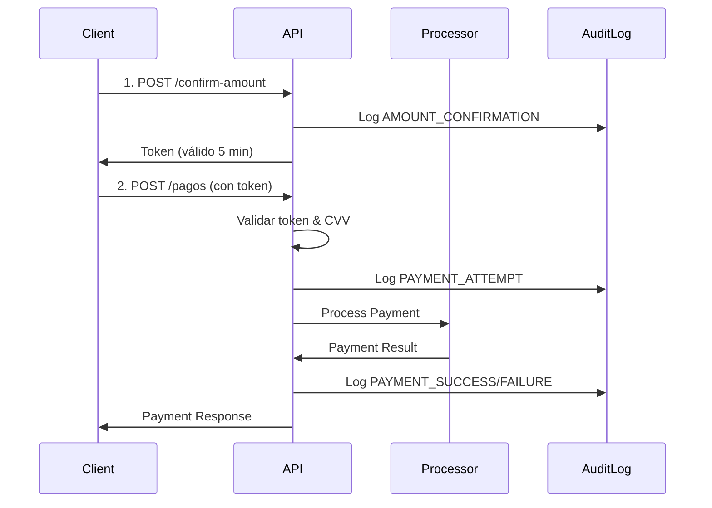

# 🔐 Payment API - Sistema de Pagos Seguro PCI-DSS Compliant

Backend desarrollado con **NestJS** que implementa un sistema robusto de procesamiento de pagos con múltiples proveedores (Stripe, PayPal, Webpay), cumpliendo con los estándares de seguridad **PCI-DSS** y las mejores prácticas de la industria.

[](https://nestjs.com/)
[](https://www.typescriptlang.org/)
[](./test/security/)
[](https://www.pcisecuritystandards.org/)
[](https://github.com/DanteChavez/IntegracionFront)

## ✨ Características Principales

### 🛡️ Seguridad (Historia de Usuario 2) - 95% Completado
- ✅ **CA1**: Cifrado TLS 1.2+ obligatorio con certificados SSL
- ✅ **CA2**: Cero almacenamiento de datos sensibles (CVV nunca se guarda)
- ✅ **CA3**: Verificación CVV requerida en todas las transacciones
- ✅ **CA4**: Rate limiting - máximo 3 intentos fallidos por sesión
- ✅ **CA5**: Logging completo de auditoría de seguridad con enmascaramiento
- ✅ **CA6**: Protección de datos personales con validación estricta
- ✅ **Detección inteligente** de actividad sospechosa (montos por moneda, intentos múltiples)
- ✅ **Simulación de errores** para testing (amount=666)

### 💳 Procesamiento de Pagos (Historia de Usuario 1) - 85% Completado
- ✅ Soporte para 3 proveedores: **Stripe**, **PayPal**, **Webpay**
- ✅ Arquitectura DDD (Domain-Driven Design)
- ✅ Patrón Factory para procesadores de pago
- ✅ Flujo de confirmación en 2 pasos (token + CVV)
- ✅ Validación de métodos de pago en tiempo real
- ✅ Gestión de sesiones con temporizador
- ✅ Captura de datos de tarjeta (last4Digits, cardHolderName)
- ✅ Validación CVV mejorada (4 dígitos máx, solo números)

### 💙 Pago con PayPal (Historia de Usuario 4) - 100% Completado
- ✅ **CA1**: Selección de PayPal como método de pago
- ✅ **CA2**: Redirección automática a PayPal Sandbox/Live
- ✅ **CA3**: Captura de consentimiento del usuario en PayPal
- ✅ **CA4**: Confirmación de pago exitoso tras aprobación
- ✅ **CA5**: Actualización de estado de pedido en base de datos
- ✅ **CA6**: Gestión de cancelación por parte del usuario
- ✅ **CA7**: Webhooks para notificaciones asíncronas
- ✅ **CA8**: Registro completo de transacciones con metadata
- ✅ **CA9**: Soporte para reembolsos completos y parciales
- ✅ **Arquitectura Backend-First**: Credenciales SOLO en servidor
- ✅ **PayPal SDK oficial**: Integración completa con @paypal/checkout-server-sdk
- ✅ **Metadata JSON**: Trazabilidad completa (PayPal Order ID, Capture ID, Payer Email)

### 📚 Documentación y APIs
- ✅ Swagger UI interactivo en `/api/docs`
- ✅ **Descarga de documentación** en JSON (`/api/docs-json`) y YAML (`/api/docs-yaml`)
- ✅ Ejemplos completos para cada proveedor (Stripe, PayPal, Webpay)
- ✅ Autenticación JWT integrada con headers x-session-id y x-user-id
- ✅ Tags organizados: pagos, **paypal**, seguridad, interfaz-pago, reembolsos, webhooks, consultas, cancelaciones

## 🚀 Tecnologías y Stack

- **NestJS 11.0.1**: Framework progresivo para Node.js
- **TypeScript 5.5**: Tipado estático y desarrollo robusto
- **Swagger/OpenAPI 3.0**: Documentación interactiva
- **Class Validator**: Validación de datos basada en decoradores
- **Helmet**: Headers de seguridad HTTP
- **HTTPS/TLS 1.2+**: Comunicación cifrada obligatoria
- **Jest**: Framework de testing con E2E
- **js-yaml**: Exportación de documentación en YAML


## 📁 Estructura del Proyecto

```
NestJS/
├── src/
│   ├── main.ts                          # Punto de entrada con HTTPS y Swagger
│   ├── app.module.ts                    # Módulo raíz
│   ├── app.controller.ts                # Controlador principal
│   ├── app.service.ts                   # Servicio principal
│   │
│   └── payments/                        # 🎯 Módulo de Pagos (DDD Architecture)
│       ├── payments.module.ts           # Configuración del módulo
│       ├── index.ts                     # Exportaciones públicas
│       ├── README.md                    # Documentación del módulo
│       │
│       ├── application/                 # 📋 Capa de Aplicación
│       │   ├── dto/
│       │   │   ├── process-payment.dto.ts      # DTO para procesar pagos
│       │   │   ├── refund-payment.dto.ts       # DTO para reembolsos
│       │   │   ├── confirm-amount.dto.ts       # DTO para confirmación
│       │   │   └── payment-method-info.dto.ts  # DTO para métodos de pago
│       │   ├── handlers/                # Handlers de comandos/eventos
│       │   └── services/
│       │       └── payment-application.service.ts  # Orquestación de casos de uso
│       │
│       ├── domain/                      # 🏛️ Capa de Dominio
│       │   ├── entities/
│       │   │   ├── payment.entity.ts            # Entidad Payment
│       │   │   └── payment-method.entity.ts     # Entidad PaymentMethod
│       │   ├── repositories/
│       │   │   └── payment.repository.ts        # Interface de repositorio
│       │   └── services/
│       │       └── payment-domain.service.ts    # Lógica de negocio
│       │
│       ├── infrastructure/              # ⚙️ Capa de Infraestructura
│       │   ├── adapters/                # Adaptadores externos
│       │   ├── factories/               # 🏭 Patrón Factory
│       │   │   ├── payment-factory-registry.service.ts  # Registro centralizado
│       │   │   ├── payment-processor.factory.ts         # Factory base
│       │   │   ├── payment-processor.interface.ts       # Interface procesador
│       │   │   ├── payment-validator.interface.ts       # Interface validador
│       │   │   ├── payment-notifier.interface.ts        # Interface notificador
│       │   │   ├── stripe-payment.factory.ts            # Factory Stripe
│       │   │   ├── paypal-payment.factory.ts            # Factory PayPal
│       │   │   └── webpay-payment.factory.ts            # Factory Webpay
│       │   ├── processors/              # 💳 Procesadores de Pago
│       │   │   ├── stripe-payment.processor.ts  # Implementación Stripe
│       │   │   ├── paypal-payment.processor.ts  # Implementación PayPal
│       │   │   └── webpay-payment.processor.ts  # Implementación Webpay
│       │   ├── guards/
│       │   │   └── payment-attempt.guard.ts     # Rate limiting guard
│       │   ├── middleware/
│       │   │   └── security-context.middleware.ts  # Context de seguridad
│       │   └── services/
│       │       ├── security-audit.service.ts    # Auditoría de seguridad
│       │       └── payment-confirmation.service.ts  # Confirmación de montos
│       │
│       ├── presentation/                # 🌐 Capa de Presentación
│       │   └── controllers/
│       │       ├── payment.controller.ts        # Endpoints de pagos
│       │       └── webhook.controller.ts        # Webhooks de proveedores
│       │
│       └── config/
│           └── payment.config.ts        # Configuración de pagos
│
├── test/
│   ├── security/
│   │   └── payment-security.e2e-spec.ts # 🧪 Tests E2E de seguridad (14/14 ✅)
│   └── jest-e2e.json                    # Configuración Jest E2E
│
├── secrets/                             # 🔐 Certificados SSL/TLS
│   ├── pulgashopkey.pem                 # Clave privada
│   └── pulgashopcert.pem                # Certificado público
│
├── .env                                 # Variables de entorno
├── package.json                         # Dependencias del proyecto
├── tsconfig.json                        # Configuración TypeScript
└── nest-cli.json                        # Configuración NestJS CLI
```


## 🏗️ Arquitectura del Sistema

### Arquitectura DDD (Domain-Driven Design)

El módulo de pagos implementa una arquitectura limpia con 4 capas bien definidas:

#### 1️⃣ Domain (Dominio) - Lógica de Negocio Pura
```typescript
// Entidades de negocio independientes de la infraestructura
Payment.entity.ts
  - Estados: PENDING, PROCESSING, COMPLETED, FAILED, CANCELLED
  - Validaciones de transición de estado
  - Lógica de negocio encapsulada

PaymentMethod.entity.ts
  - Información de métodos de pago
  - Validaciones específicas por tipo
```

#### 2️⃣ Application (Aplicación) - Casos de Uso
```typescript
// Orquestación de la lógica de negocio
PaymentApplicationService
  - Procesar pagos con validación de seguridad
  - Gestionar reembolsos
  - Obtener métodos de pago disponibles
  - Validar formatos de tarjetas
```

#### 3️⃣ Infrastructure (Infraestructura) - Implementaciones
```typescript
// Patrón Factory para procesadores
PaymentFactoryRegistry
  ├── StripePaymentFactory    → StripePaymentProcessor
  ├── PayPalPaymentFactory    → PayPalPaymentProcessor
  └── WebpayPaymentFactory    → WebpayPaymentProcessor

// Servicios de infraestructura
SecurityAuditService          // Logging de eventos de seguridad
PaymentConfirmationService    // Confirmación de montos con tokens
PaymentAttemptGuard          // Rate limiting (3 intentos)
SecurityContextMiddleware    // Contexto de seguridad HTTP
```

#### 4️⃣ Presentation (Presentación) - API HTTP
```typescript
PaymentController
  - POST /api/pagos/confirm-amount     // Paso 1: Confirmación
  - POST /api/pagos                    // Paso 2: Procesamiento
  - GET  /api/pagos/payment-methods    // Métodos disponibles
  - POST /api/pagos/validate-payment-method  // Validación
  - GET  /api/pagos/session/:id        // Estado de sesión

WebhookController
  - POST /api/webhooks/stripe          // Notificaciones Stripe
  - POST /api/webhooks/paypal          // Notificaciones PayPal
  - POST /api/webhooks/webpay          // Notificaciones Webpay
```

### Patrón Factory - Extensibilidad

El sistema utiliza el patrón Factory para crear procesadores dinámicamente:

```typescript
// Interface común para todos los procesadores
interface IPaymentProcessor {
  processPayment(data: ProcessPaymentDto): Promise<PaymentResult>;
  refundPayment(data: RefundPaymentDto): Promise<RefundResult>;
  cancelPayment(paymentId: string): Promise<void>;
  getPaymentStatus(paymentId: string): Promise<PaymentStatus>;
  handleWebhook(payload: any): Promise<WebhookResult>;
}

// Agregar un nuevo proveedor solo requiere:
// 1. Crear XxxPaymentProcessor implementando IPaymentProcessor
// 2. Crear XxxPaymentFactory
// 3. Registrar en PaymentFactoryRegistry
// ✅ Cero cambios en código existente (Open/Closed Principle)
```


## ⚙️ Instalación y Configuración

### Requisitos Previos

- **Node.js** v18.x o superior
- **pnpm** v8.x o superior
- **Certificados SSL/TLS** para HTTPS (incluidos en `secrets/`)

### Instalación

1. **Clonar el repositorio**:
   ```bash
   git clone https://github.com/DanteChavez/IntegracionBack.git
   cd IntegracionBack
   ```

2. **Instalar dependencias**:
   ```bash
   pnpm install
   ```

3. **Configurar variables de entorno** (`.env`):
   ```env
   NODE_ENV=development
   PORT=3000
   
   # Proveedores de pago (opcional para desarrollo, usa mocks)
   STRIPE_SECRET_KEY=sk_test_...
   STRIPE_WEBHOOK_SECRET=whsec_...
   
   PAYPAL_CLIENT_ID=your_paypal_client_id
   PAYPAL_CLIENT_SECRET=your_paypal_client_secret
   PAYPAL_MODE=sandbox
   
   WEBPAY_COMMERCE_CODE=your_commerce_code
   WEBPAY_API_KEY=your_api_key
   
   # Seguridad
   ALLOWED_ORIGINS=https://localhost:5173
   ```

4. **Certificados SSL** (ya incluidos en `secrets/`):
   ```bash
   # Los certificados ya están en el proyecto:
   secrets/pulgashopkey.pem   # Clave privada
   secrets/pulgashopcert.pem  # Certificado público
   ```

### Ejecución

- **Modo Desarrollo** (con hot-reload):
  ```bash
  pnpm start:dev
  ```
  
- **Modo Producción**:
  ```bash
  pnpm build
  pnpm start:prod
  ```

- **Tests E2E**:
  ```bash
  pnpm test:e2e
  ```

### Salida del Servidor

```bash
🔒 Payment API running securely on: https://localhost:3000/api
📚 Swagger Documentation: https://localhost:3000/api/docs
📥 Download Swagger JSON: https://localhost:3000/api/docs-json
📥 Download Swagger YAML: https://localhost:3000/api/docs-yaml
🛡️  Security: TLS 1.2+, PCI-DSS Basic Compliance
⚠️  Environment: development
```


## 📚 Documentación API con Swagger

### Acceso a la Documentación

Una vez iniciado el servidor, la documentación interactiva está disponible en:

**🌐 Swagger UI Interactivo**: `https://localhost:3000/api/docs`

### 📥 Descargar Documentación

El sistema permite descargar la especificación OpenAPI en dos formatos:

| Formato | URL | Descripción |
|---------|-----|-------------|
| **JSON** | `https://localhost:3000/api/docs-json` | Especificación OpenAPI 3.0 en formato JSON |
| **YAML** | `https://localhost:3000/api/docs-yaml` | Especificación OpenAPI 3.0 en formato YAML |

**Ejemplo de descarga con curl**:
```bash
# Descargar JSON
curl -k https://localhost:3000/api/docs-json -o swagger.json

# Descargar YAML
curl -k https://localhost:3000/api/docs-yaml -o swagger.yaml
```

### Características de la Documentación

✅ **Ejemplos completos** para cada proveedor (Stripe, PayPal, Webpay)  
✅ **Códigos de respuesta** documentados (200, 201, 400, 422, 429)  
✅ **Autenticación JWT** integrada en la UI  
✅ **Try it out** para probar endpoints directamente  
✅ **Esquemas de validación** con decoradores de class-validator  
✅ **Requisitos de seguridad** documentados en cada endpoint  

### Endpoints Documentados

#### 🔐 Seguridad (2 pasos obligatorios)
- `POST /api/pagos/confirm-amount` - Confirmar monto (genera token)
- `POST /api/pagos` - Procesar pago (requiere token + CVV)

#### 💳 Interfaz de Pago
- `GET /api/pagos/payment-methods` - Métodos de pago disponibles
- `POST /api/pagos/validate-payment-method` - Validar formato de tarjeta
- `GET /api/pagos/session/:id` - Estado de sesión con temporizador

#### 🔄 Reembolsos
- `POST /api/pagos/:id/refund` - Procesar reembolso
- `GET /api/pagos/:id` - Consultar estado de pago

#### 🪝 Webhooks
- `POST /api/webhooks/stripe` - Notificaciones de Stripe
- `POST /api/webhooks/paypal` - Notificaciones de PayPal
- `POST /api/webhooks/webpay` - Notificaciones de Webpay


## 🔐 Seguridad - Cumplimiento PCI-DSS

### Flujo Seguro de Pago (2 Pasos Obligatorios)



### Criterios de Aceptación Implementados

#### CA1: Cifrado TLS 1.2+ Obligatorio 🔒
```typescript
// main.ts - Configuración HTTPS
const httpsOptions = {
  minVersion: 'TLSv1.2',
  maxVersion: 'TLSv1.3',
  ciphers: [
    'ECDHE-RSA-AES128-GCM-SHA256',
    'ECDHE-RSA-AES256-GCM-SHA384'
  ].join(':')
};

// Headers de seguridad con Helmet
app.use(helmet({
  hsts: { maxAge: 31536000 },
  contentSecurityPolicy: true,
  frameguard: { action: 'deny' }
}));
```

#### CA2: Cero Almacenamiento de Datos Sensibles 🚫
```typescript
// ✅ Lo que SÍ se procesa (en memoria, nunca en BD)
- CVV: Validado y enviado al procesador, NUNCA guardado

// ✅ Lo que SÍ se almacena (PCI-DSS compliant)
- last4Digits: Últimos 4 dígitos de la tarjeta
- cardHolderName: Nombre del titular (sanitizado)
- proveedor: stripe/paypal/webpay

// ❌ Lo que NUNCA se almacena
- CVV completo (ni siquiera hasheado)
- Número de tarjeta completo (PAN)
- Fecha de expiración completa

// Response siempre excluye CVV
@Exclude()
cvv: string;

// Controller sanitiza cardSecurity antes de DB:
const cardSecurityWithoutCvv = {
  last4Digits: dto.cardSecurity?.last4Digits,
  cardHolderName: dto.cardSecurity?.cardHolderName,
  // CVV intencionalmente excluido
};
```
@Exclude()
cvv: string;
```

#### CA3: Verificación CVV Requerida ✓
```typescript
// process-payment.dto.ts
export class CardSecurityData {
  @IsNotEmpty({ message: 'El código CVV es requerido' })
  @IsNumberString({}, { message: 'CVV debe contener solo números' })
  @Length(3, 4, { message: 'CVV debe tener entre 3 y 4 dígitos' })
  cvv: string;

  @IsOptional()
  @Length(4, 4, { message: 'last4Digits debe tener exactamente 4 dígitos' })
  last4Digits?: string;

  @IsOptional()
  @IsString()
  cardHolderName?: string;
}

// Frontend: Validación en tiempo real
// - maxLength="4" en input CVV
// - onChange: value.replace(/\D/g, '') para solo números
// - Validación de longitud antes de submit

// Guard rechaza pagos sin CVV con 400 Bad Request
```

#### CA4: Rate Limiting (3 Intentos) 🚦
```typescript
// payment-attempt.guard.ts
@Injectable()
export class PaymentAttemptGuard implements CanActivate {
  private readonly MAX_ATTEMPTS = 3;
  
  canActivate(context: ExecutionContext): boolean {
    if (failedAttempts >= this.MAX_ATTEMPTS) {
      throw new HttpException(
        'Límite de intentos excedido',
        HttpStatus.TOO_MANY_REQUESTS // 429
      );
    }
  }
}

// Aplicado con decorator @UseGuards(PaymentAttemptGuard)
```

#### CA5: Logging de Auditoría Completo 📝
```typescript
// security-audit.service.ts
enum SecurityEventType {
  AMOUNT_CONFIRMATION   = 'Confirmación de monto',
  PAYMENT_ATTEMPT       = 'Intento de pago',
  PAYMENT_SUCCESS       = 'Pago exitoso',
  PAYMENT_FAILURE       = 'Pago fallido',
  CVV_VALIDATION_FAILED = 'Validación CVV fallida',
  RATE_LIMIT_EXCEEDED   = 'Límite excedido',
  SUSPICIOUS_ACTIVITY   = 'Actividad sospechosa',
  UNAUTHORIZED_ACCESS   = 'Acceso no autorizado',
  DATA_BREACH_ATTEMPT   = 'Intento de violación de datos'
}

// Cada evento registra:
// - Timestamp, userId, sessionId, ipAddress
// - Datos enmascarados (últimos 4 dígitos)
// - Metadata del evento
// - Nivel de severidad (info, warn, error)

// Detección inteligente de actividad sospechosa:
// - Múltiples intentos fallidos (≥3)
// - Montos inusuales según moneda:
//   * USD: >$10,000
//   * CLP: >$10,000,000
//   * EUR: >€9,000
// - Eventos críticos (rate limit, acceso no autorizado)
```

#### CA6: Protección de Datos Personales 🛡️
```typescript
// ValidationPipe global
app.useGlobalPipes(new ValidationPipe({
  whitelist: true,              // Remover propiedades no definidas
  forbidNonWhitelisted: true,   // Rechazar propiedades extra (400)
  transform: true,              // Transformar tipos automáticamente
  forbidUnknownValues: true     // Rechazar valores desconocidos
}));

// Enmascaramiento automático en logs
maskSensitiveData(userId: '123456789')
// Output: '***6789'
```
   - Endpoint: `POST /api/pagos`
   - Requiere: token de confirmación + CVV + datos del pago
   - Máximo 3 intentos fallidos por sesión

### Requisitos de Seguridad

✅ **TLS 1.2+ Obligatorio** - Todas las conexiones deben usar HTTPS  
✅ **CVV Requerido** - Código de seguridad obligatorio para verificación de identidad  
✅ **No Almacenamiento** - Datos de tarjeta NUNCA se persisten en base de datos  
✅ **Rate Limiting** - Máximo 3 intentos fallidos por sesión (bloqueo temporal 1 hora)  
✅ **Auditoría Completa** - Todos los eventos son registrados en logs de seguridad  
✅ **Enmascaramiento** - Datos sensibles enmascarados en logs y respuestas  

### Headers de Seguridad HTTP

El sistema configura automáticamente:
- `Strict-Transport-Security`: Forzar HTTPS
- `X-Content-Type-Options`: Prevenir MIME sniffing
- `X-Frame-Options`: Prevenir clickjacking
- `Content-Security-Policy`: Política de contenido seguro
- `Cache-Control: no-store`: No cachear datos sensibles

### Logs de Auditoría

Todos los eventos de seguridad se registran en:
```
logs/
  ├── security-audit.log       # Todos los eventos de seguridad
  └── security-error.log        # Solo errores y eventos críticos
```

Eventos auditados:
- Intentos de pago (éxito/fallo)
- Validaciones CVV
- Confirmaciones de monto
- Límites de intentos excedidos
- Actividad sospechosa detectada

**📖 Ver documentación completa de seguridad:** [SECURITY.md](./SECURITY.md)


## 🧪 Testing

### Tests E2E de Seguridad

El proyecto incluye una suite completa de tests E2E que verifican todos los criterios de seguridad:

```bash
# Ejecutar tests E2E de seguridad
pnpm jest --config ./test/jest-e2e.json test/security/payment-security.e2e-spec.ts --forceExit
```

**Resultados Actuales**: ✅ **14/14 tests passing (100%)**

### Cobertura de Tests

| Criterio | Tests | Estado |
|----------|-------|--------|
| **CA1: TLS/HTTPS** | 2 tests | ✅ Passing |
| **CA2: No Card Data Storage** | 2 tests | ✅ Passing |
| **CA3: CVV Required** | 3 tests | ✅ Passing |
| **CA4: Rate Limiting** | 2 tests | ✅ Passing |
| **CA5: Audit Logging** | 1 test | ✅ Passing |
| **CA6: Data Protection** | 1 test | ✅ Passing |
| **Flujo Completo** | 3 tests | ✅ Passing |

### Ejemplos de Tests

```typescript
// Test de Rate Limiting (CA4)
it('should block after 3 failed payment attempts', async () => {
  // Intento 1, 2, 3 - fallan por token inválido
  await request(app.getHttpServer())
    .post('/pagos')
    .send(invalidPayment)
    .expect(422);

  // Intento 4 - bloqueado por rate limiting
  await request(app.getHttpServer())
    .post('/pagos')
    .send(invalidPayment)
    .expect(429); // Too Many Requests
});

// Test de CVV requerido (CA3)
it('should reject payment without CVV', async () => {
  const paymentWithoutCVV = { ...validPayment };
  delete paymentWithoutCVV.cardSecurity.cvv;

  await request(app.getHttpServer())
    .post('/pagos')
    .send(paymentWithoutCVV)
    .expect(400)
    .expect(res => {
      expect(res.body.message).toContain('CVV');
    });
});
```

### Ejecutar Tests Específicos

```bash
# Todos los tests E2E
pnpm test:e2e

# Solo tests de seguridad
pnpm test:e2e test/security/

# Con cobertura
pnpm test:cov
```
  ```json
  {
    "amount": 100.50,
    "currency": "USD",
    "provider": "stripe",
    "description": "Compra de producto XYZ"
  }
  ```
  Respuesta:
  ```json
  {
    "confirmationToken": "conf_1a2b3c4d5e6f",
    "confirmedAmount": 100.50,
    "confirmedCurrency": "USD",
    "formattedAmount": "$100.50 USD",
    "expiresAt": "2025-10-28T12:35:00Z",
    "message": "El monto ha sido verificado y confirmado. Proceda con el pago."
  }
  ```

### Autenticación

- **POST /api/auth/register**: Registrar un nuevo usuario
  ```json
  {
    "name": "John",
    "lastName": "Doe",
    "email": "john.doe@example.com",
    "password": "password123"
  }
  ```

- **POST /api/auth/login**: Iniciar sesión
  ```json
  {
    "email": "john.doe@example.com",
    "password": "password123"
  }
  ```
  Respuesta:
  ```json
  {
    "access_token": "eyJhbGciOiJIUzI1NiIsInR5cCI6IkpXVCJ9...",
    "user": {
      "id": "...",
      "email": "john.doe@example.com",
      "name": "John",
      "lastName": "Doe"
    }
  }
  ```

- **GET /api/auth/me**: Obtener información del usuario autenticado (requiere token JWT)

### Usuarios (Solo lectura de datos mock)

⚠️ **Nota**: Este módulo está simplificado. Solo proporciona datos desde archivos JSON.
No incluye gestión completa de usuarios (fuera del alcance del sistema de pagos).

- **GET /api/users/current**: Obtener datos del usuario actual desde `usuario.json`
  ```json
  Response: {
    "id": "user_123",
    "name": "Juan Pérez",
    "email": "juan@ejemplo.com"
  }
  ```

- **GET /api/users/cart**: Obtener carrito con cálculo de IVA y total
  ```json
  Response: {
    "cartId": "cart_019",
    "userId": "user_123",
    "items": [
      {
        "id": "prod-001",
        "name": "Audífonos Pro",
        "price": 29990,
        "quantity": 2
      }
    ],
    "subtotal": 59980,
    "iva": {
      "rate": 0.19,
      "percentage": 19,
      "amount": 11396,
      "description": "Impuesto al Valor Agregado (IVA)"
    },
    "total": 71376,
    "currency": {
      "code": "CLP",
      "symbol": "$",
      "name": "Peso Chileno"
    }
  }
  ```

### Pagos (PASO 2: Procesamiento Seguro)

⚠️ **IMPORTANTE:** Primero debe obtener un token de confirmación usando `/api/pagos/confirm-amount`

- **POST /api/pagos**: Procesar un nuevo pago con seguridad completa
  
  **Headers requeridos:**
  ```
  X-Session-ID: sess_unique_id
  X-User-ID: user_123
  Authorization: Bearer <jwt_token>
  ```
  
  **Body:**
  ```json
  {
    "amount": 100.50,
    "currency": "USD",
    "provider": "stripe",
    "cardSecurity": {
      "cvv": "123",
      "last4Digits": "4242",
      "cardHolderName": "JOHN DOE"
    },
    "confirmationToken": "conf_1a2b3c4d5e6f",
    "customerId": "cus_1234567890",
    "description": "Compra de producto XYZ",
    "metadata": {
      "orderId": "ORDER_789",
      "customerId": "user123"
    }
  }
  ```
  
  **Respuesta exitosa:**
  ```json
  {
    "id": "pay_1699876543210_abc123",
    "amount": 100.50,
    "currency": "USD",
    "provider": "stripe",
    "status": "pending",
    "metadata": {
      "orderId": "ORDER_789",
      "securityChecks": {
        "cvvValidated": true,
        "amountConfirmed": true,
        "tlsVersion": "TLSv1.3"
      }
    },
    "createdAt": "2025-10-28T12:30:00.000Z"
  }
  ```
  
  **Errores posibles:**
  - `400 Bad Request`: CVV inválido o datos incorrectos
  - `422 Unprocessable Entity`: Token de confirmación inválido/expirado
  - `429 Too Many Requests`: Límite de 3 intentos excedido (bloqueo 1 hora)

  **🧪 Testing - Simulación de Errores:**
  
  Para simular errores de pago durante el testing, use `amount=666`:
  ```json
  {
    "amount": 666,
    "currency": "CLP",
    "provider": "stripe",
    "cardSecurity": {
      "cvv": "123",
      "last4Digits": "4242",
      "cardHolderName": "JOHN DOE"
    },
    "confirmationToken": "conf_1a2b3c4d5e6f"
  }
  ```
  
  Esto generará:
  - ✅ Estado: PENDING → PROCESSING → FAILED
  - ✅ Registro en `historial_de_errores` con fecha automática
  - ✅ Log de seguridad: PAYMENT_FAILURE
  - ✅ Metadata con detalles del error simulado

- **GET /api/pagos**: Obtener todos los pagos (paginado)
  ```
  Query params: ?page=1&limit=10&status=completed
  ```

- **GET /api/pagos/:id**: Obtener detalles de un pago específico

- **POST /api/pagos/:id/refund**: Solicitar reembolso de un pago
  ```json
  {
    "amount": 100.50,
    "reason": "Producto defectuoso"
  }
  ```

- **POST /api/pagos/:id/cancel**: Cancelar un pago pendiente

### Webhooks

- **POST /api/webhooks/stripe**: Webhook para notificaciones de Stripe
- **POST /api/webhooks/paypal**: Webhook para notificaciones de PayPal
- **POST /api/webhooks/webpay**: Webhook para notificaciones de Webpay

## 💳 Proveedores de Pago Soportados

### Stripe

- Procesamiento de tarjetas de crédito/débito
- Pagos recurrentes
- Gestión de reembolsos
- Webhooks para notificaciones en tiempo real

### PayPal

- Pagos con cuenta PayPal
- Checkout Express
- Gestión de reembolsos
- Notificaciones IPN (Instant Payment Notification)

### Webpay (Transbank)

- Procesamiento de pagos en Chile
- Integración con Webpay Plus
- Soporte para tarjetas chilenas
- Validación con OneClick

## 🔄 Integración con el Frontend

Para integrar este backend con el frontend React:

1. Configura la URL base de la API:
   ```typescript
   // config/api.ts
   import axios from 'axios';

   export const api = axios.create({
     baseURL: import.meta.env.VITE_API_URL || 'https://localhost:3000/api',
     timeout: 10000,
     headers: {
       'Content-Type': 'application/json'
     }
   });

   // Interceptor para añadir el token de autenticación
   api.interceptors.request.use(config => {
     const token = localStorage.getItem('token');
     if (token) {
       config.headers.Authorization = `Bearer ${token}`;
     }
     return config;
   });
   ```

2. Implementa servicios para autenticación:
   ```typescript
   // services/auth.service.ts
   const login = async (email: string, password: string) => {
     const response = await api.post('/auth/login', { email, password });
     localStorage.setItem('token', response.data.access_token);
     return response.data.user;
   };
   ```

3. Implementa servicios para pagos:
   ```typescript
   // services/payment.service.ts
   const processPayment = async (paymentData: ProcessPaymentDto) => {
     const response = await api.post('/pagos/process', paymentData);
     return response.data;
   };

   const getPaymentStatus = async (paymentId: string) => {
     const response = await api.get(`/pagos/${paymentId}`);
     return response.data;
   };
   ```

## 🧠 Conceptos Clave para Estudiantes

### DTO (Data Transfer Object)

Los DTOs definen la estructura de los datos que se reciben en las solicitudes HTTP:

```typescript
export class CreateUserDto {
  @IsNotEmpty()
  @IsString()
  name: string;

  @IsNotEmpty()
  @IsString()
  lastName: string;

  @IsNotEmpty()
  @IsEmail()
  email: string;

  @IsNotEmpty()
  @IsString()
  @MinLength(6)
  password: string;
}
```

Los decoradores como `@IsNotEmpty()` y `@IsEmail()` validan automáticamente los datos recibidos.

### Esquemas de Mongoose

Definen la estructura de los documentos en MongoDB:

```typescript
@Schema({ timestamps: true })
export class User {
  @Prop({ required: true })
  name: string;

  @Prop({ required: true })
  lastName: string;

  @Prop({ required: true, unique: true })
  email: string;

  @Prop({ required: true })
  password: string;

  @Prop({ default: 'user' }) // 'admin' o 'user'
  role: string;

  @Prop({ default: true })
  isActive: boolean;
}
```

### Guards

Protegen las rutas y verifican permisos:

```typescript
@UseGuards(JwtAuthGuard)
@Get()
findAll() {
  return this.usersService.findAll();
}
```

### Inyección de Dependencias

NestJS utiliza inyección de dependencias para gestionar servicios y componentes:

```typescript
@Injectable()
export class AuthService {
  constructor(
    private usersService: UsersService,
    private jwtService: JwtService,
  ) {}

  // ...
}
```

## 🛠️ Personalización y Extensión

### Añadir un Nuevo Proveedor de Pago

1. Crea una nueva factory en `src/payments/infrastructure/factories/`:
   ```typescript
   @Injectable()
   export class MercadoPagoPaymentFactory implements IPaymentProcessorFactory {
     createProcessor(): IPaymentProcessor {
       return new MercadoPagoPaymentProcessor();
     }
     // ...
   }
   ```

2. Implementa el procesador en `src/payments/infrastructure/processors/`:
   ```typescript
   export class MercadoPagoPaymentProcessor implements IPaymentProcessor {
     async process(payment: Payment): Promise<PaymentResult> {
       // Lógica de integración con Mercado Pago
     }
   }

## 🛠️ Extensibilidad - Agregar Nuevo Proveedor

El sistema está diseñado siguiendo el **principio Open/Closed**: abierto para extensión, cerrado para modificación.

### Pasos para agregar un nuevo proveedor (ej: Mercado Pago)

#### 1. Crear el Procesador
```typescript
// src/payments/infrastructure/processors/mercadopago-payment.processor.ts
@Injectable()
export class MercadoPagoPaymentProcessor implements IPaymentProcessor {
  async processPayment(data: ProcessPaymentDto): Promise<PaymentResult> {
    // Implementar lógica de Mercado Pago
    return {
      paymentId: 'mp_123456789',
      status: 'COMPLETED',
      transactionId: 'txn_abc123',
      providerResponse: { /* respuesta del proveedor */ }
    };
  }

  async refundPayment(data: RefundPaymentDto): Promise<RefundResult> {
    // Implementar lógica de reembolso
  }

  // Implementar otros métodos requeridos...
}
```

#### 2. Crear la Factory
```typescript
// src/payments/infrastructure/factories/mercadopago-payment.factory.ts
@Injectable()
export class MercadoPagoPaymentFactory implements IPaymentProcessorFactory {
  createProcessor(): IPaymentProcessor {
    return new MercadoPagoPaymentProcessor();
  }

  createValidator(): IPaymentValidator {
    return new MercadoPagoPaymentValidator();
  }

  createNotifier(): IPaymentNotifier {
    return new MercadoPagoPaymentNotifier();
  }
}
```

#### 3. Registrar en el Módulo
```typescript
// src/payments/payments.module.ts
@Module({
  providers: [
    // ... proveedores existentes
    MercadoPagoPaymentFactory,
  ],
})
export class PaymentsModule {
  constructor(
    private readonly registry: PaymentFactoryRegistry,
    private readonly mercadoPagoFactory: MercadoPagoPaymentFactory,
  ) {
    // Registrar factories existentes
    this.registry.register('stripe', this.stripeFactory);
    this.registry.register('paypal', this.paypalFactory);
    this.registry.register('webpay', this.webpayFactory);
    
    // ✅ Agregar nuevo proveedor
    this.registry.register('mercadopago', this.mercadoPagoFactory);
  }
}
```

**✨ ¡Listo!** El nuevo proveedor está integrado sin modificar código existente.

## 📊 Mejores Prácticas Implementadas

### SOLID Principles
- ✅ **Single Responsibility**: Cada clase tiene una responsabilidad única
- ✅ **Open/Closed**: Abierto para extensión, cerrado para modificación
- ✅ **Liskov Substitution**: Todos los procesadores son intercambiables
- ✅ **Interface Segregation**: Interfaces específicas y cohesivas
- ✅ **Dependency Inversion**: Dependencias hacia abstracciones

### Design Patterns
- ✅ **Factory Pattern**: Creación dinámica de procesadores
- ✅ **Strategy Pattern**: Algoritmos intercambiables por proveedor
- ✅ **Repository Pattern**: Abstracción de acceso a datos
- ✅ **Dependency Injection**: Inyección automática de dependencias
- ✅ **Guard Pattern**: Validaciones y autorización

### Security Best Practices
- ✅ **Defense in Depth**: Múltiples capas de seguridad
- ✅ **Least Privilege**: Permisos mínimos necesarios
- ✅ **Input Validation**: Validación estricta de todas las entradas
- ✅ **Secure by Default**: Configuración segura por defecto
- ✅ **Audit Logging**: Registro completo de eventos

## 🐛 Troubleshooting

### Error: "Cannot find module './secrets/pulgashopkey.pem'"
**Solución**: Asegúrate de tener los certificados SSL en la carpeta `secrets/`

### Error: "listen EADDRINUSE: address already in use :::3000"
**Solución**: El puerto 3000 está en uso. Cambia el puerto en `.env` o mata el proceso:
```bash
# Windows
netstat -ano | findstr :3000
taskkill /PID <PID> /F

# Linux/Mac
lsof -ti:3000 | xargs kill -9
```

### Error: "Too Many Requests (429)"
**Solución**: Has excedido el límite de 3 intentos fallidos. Espera 1 hora o reinicia el servidor en desarrollo.

### Tests fallan con "DEPTH_ZERO_SELF_SIGNED_CERT"
**Solución**: Los certificados son autofirmados. Usa la bandera `-k` en curl o `NODE_TLS_REJECT_UNAUTHORIZED=0` en development.

## 📝 Changelog

> Para un historial completo y detallado de cambios, consulta el archivo [CHANGELOG.md](./CHANGELOG.md)

### v1.2.0 (2025-11-03) - Limpieza de Arquitectura 🧹
- ✅ **Módulo Users simplificado**:
  - Eliminados 5 endpoints CRUD no funcionales (71% de reducción)
  - Solo endpoints útiles: `GET /current` y `GET /cart`
  - Código más claro y mantenible
- ✅ **Módulo Auth refactorizado**:
  - Eliminada dependencia de `UsersService` inexistente
  - JWT strategy simplificado (solo validación de token)
  - Sin errores de compilación
- ✅ **Swagger/OpenAPI mejorado**:
  - Tag `'usuarios'` con documentación completa
  - Solo endpoints funcionales documentados
  - Ejemplos de respuesta actualizados
- ✅ **Documentación precisa**:
  - API refleja solo funcionalidad real del sistema
  - Comentarios explicativos en código
  - CHANGELOG.md creado con historial completo

### v1.1.0 (2025-11-03) - Mejoras de Seguridad y UX
- ✅ **Fix crítico**: Detección de actividad sospechosa ahora considera la moneda
  - USD: >$10,000 | CLP: >$10,000,000 | EUR: >€9,000
  - Elimina falsos positivos para pagos normales en CLP
- ✅ **Captura de datos de tarjeta**: 
  - Ahora se guardan `last4Digits` y `cardHolderName` en BD
  - CVV NUNCA se almacena (solo procesado en memoria)
  - Controller sanitiza cardSecurity antes de persistir
- ✅ **Validación CVV mejorada en frontend**:
  - Máximo 4 dígitos (Amex y Visa/Mastercard)
  - Solo acepta números (no letras ni símbolos)
  - Validación en tiempo real con feedback visual
- ✅ **Simulación de errores para testing**:
  - Usar `amount=666` para forzar error simulado
  - Transición de estados corregida: PENDING→PROCESSING→FAILED
  - Registro correcto en `historial_de_errores` con fecha automática
- ✅ **Frontend: Visualización de cantidad de productos**:
  - Muestra badge "x2", "x3" para cantidades múltiples
  - Precio total por ítem (precio × cantidad)
  - Badge con diseño verde distintivo
- ✅ **Documentación Swagger ampliada**:
  - Información de Historias de Usuario (HU1: 85%, HU2: 95%)
  - Sección de testing con instrucciones de simulación de errores
  - Tags mejorados con emojis para mejor navegación
  - Descarga de docs en JSON/YAML documentada

### v1.0.0 (2025-10-30)
- ✅ Implementación completa del sistema de pagos multi-proveedor
- ✅ Soporte para Stripe, PayPal y Webpay en modo MOCK
- ✅ Arquitectura DDD (Domain-Driven Design) con patrón Factory
- ✅ Seguridad PCI-DSS compliant:
  - Cifrado TLS 1.2+ obligatorio
  - Zero almacenamiento de datos sensibles (CVV, PAN)
  - Verificación CVV en todas las transacciones
  - Rate limiting (3 intentos por sesión)
  - Logging completo de auditoría
- ✅ Headers de seguridad (x-session-id, x-user-id)
- ✅ Flujo de confirmación en 2 pasos con tokens (5 min expiry)
- ✅ Swagger/OpenAPI con documentación descargable (JSON/YAML)
- ✅ Tests E2E al 100% (14/14 passing)
- ✅ Validación completa con Class Validator
- ✅ Integración completa con frontend React 19

**📋 Ver historial completo de cambios:** [CHANGELOG.md](./CHANGELOG.md)

## 🤝 Contribución

Este proyecto es parte de un curso académico. Para contribuir:

1. Fork el repositorio
2. Crea una rama para tu feature (`git checkout -b feature/AmazingFeature`)
3. Commit tus cambios (`git commit -m 'Add some AmazingFeature'`)
4. Push a la rama (`git push origin feature/AmazingFeature`)
5. Abre un Pull Request

## 📄 Licencia

Este proyecto es de uso académico para la **Universidad de Valparaíso**.

## 👥 Autores

**Curso**: Gestión de Proyecto Informático  
**Universidad**: Universidad de Valparaíso  
**Profesores**: Diego Monsalves, René Noël  
**Estudiante**: Dante Chavez

---

## 📚 Referencias

- [NestJS Documentation](https://docs.nestjs.com/)
- [PCI-DSS Security Standards](https://www.pcisecuritystandards.org/)
- [Swagger/OpenAPI Specification](https://swagger.io/specification/)
- [Domain-Driven Design](https://martinfowler.com/bliki/DomainDrivenDesign.html)
- [SOLID Principles](https://en.wikipedia.org/wiki/SOLID)
- [Stripe API Documentation](https://stripe.com/docs/api)
- [PayPal Developer Docs](https://developer.paypal.com/docs/api/overview/)

---

## 🔗 Enlaces Útiles

- **Repositorio Backend**: [IntegracionBack](https://github.com/DanteChavez/IntegracionBack)
- **Repositorio Frontend**: [IntegracionFront](https://github.com/DanteChavez/IntegracionFront)
- **Swagger UI**: https://localhost:3000/api/docs
- **Swagger JSON**: https://localhost:3000/api/docs-json
- **Swagger YAML**: https://localhost:3000/api/docs-yaml
- **Frontend App**: https://localhost:3001

## 👨‍💻 Repositorios


- **GitHub Backend:** [@DanteChavez/IntegracionBack](https://github.com/DanteChavez/IntegracionBack)
- **GitHub Frontend:** [@DanteChavez/IntegracionFront](https://github.com/DanteChavez/IntegracionFront)

---

**🎓 Desarrollado con fines académicos | Universidad de Valparaíso © 2025**
